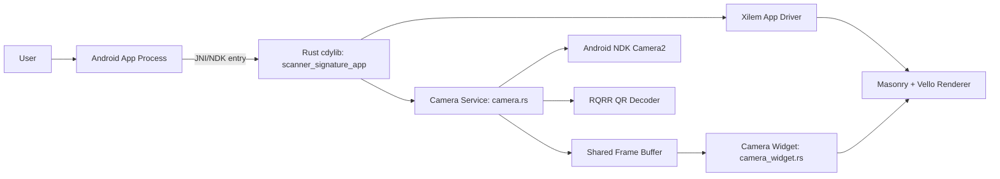
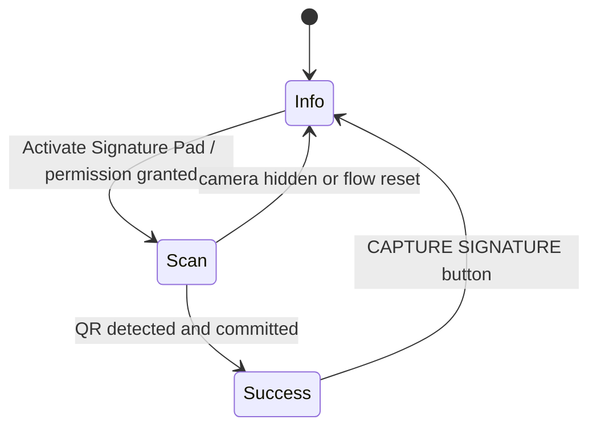
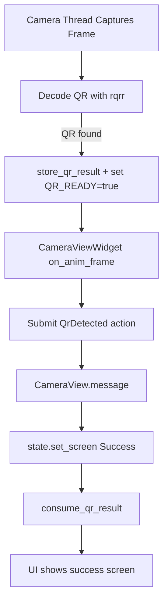

# Scanner Signature App: Project Architecture

This document explains the architecture of the scanner signature application and provides diagrams for the main runtime and screen flow.

## 1) High-Level Architecture

The project is a Rust Android application built as a `cdylib`, rendered with Xilem/Masonry/Vello, and integrated with Android Camera2 through NDK APIs.

### Main layers

1. Android host layer
- `android/` Gradle project packages and launches the app.
- Calls Rust entrypoint `android_main`.

2. App orchestration layer
- `src/lib.rs` defines `AppState`, screen routing (`Info`, `Scan`, `Success`), and app lifecycle setup.
- Owns top-level UI logic (`app_logic`).

3. Camera and QR service layer
- `src/camera.rs` manages Camera2, permission flow, frame buffering, and QR decode pipeline.
- Maintains crash-tolerant QR state via static storage.

4. Render/widget layer
- `src/camera_widget.rs` renders live camera frames and scan overlay.
- Sends `QrDetected` action into Xilem message flow.

5. UI assets layer
- `src/image_assets.rs` provides app icons and bullet assets.

6. Framework/vendor layer
- `xilem/`, `xilem_core/`, `xilem_masonry/` are framework sources.
- `vendor/masonry_core-0.4.0/` is patched Masonry core used via `[patch.crates-io]`.

## 2) System Context Diagram



## 3) Runtime Startup Flow

```mermaid
sequenceDiagram
    participant Android as Android Runtime
    participant Rust as android_main (lib.rs)
    participant Cam as camera.rs
    participant Loop as EventLoop/Xilem

    Android->>Rust: call android_main(app)
    Rust->>Rust: init logger + tracing + TMPDIR
    Rust->>Cam: store_screen_size_from_app
    Rust->>Cam: init_android_app, init_qr_channel, init_wakeup_pipe
    loop restart loop
        Rust->>Loop: run(event_loop_builder)
        alt normal exit
            Loop-->>Rust: Ok(Ok(()))
            break
        else event loop error
            Loop-->>Rust: Ok(Err(e))
            Rust->>Rust: wait_for_android_resume or sleep
        else panic
            Loop-->>Rust: Err(_)
            Rust->>Rust: wait_for_android_resume
        end
    end
```

## 4) UI Screen State Machine



## 5) QR Detection and Commit Flow



## 6) Core Modules and Responsibilities

### `src/lib.rs`
- Defines `Screen` and `AppState`.
- Contains `app_logic` state transitions and root view selection.
- Defines `info_screen`, `scan_screen`, `success_screen`.
- Android entrypoint and event-loop restart wrapper.

### `src/camera.rs`
- Camera2 setup and capture session lifecycle.
- Permission request/poll flow.
- Shared frame buffer for rendering.
- QR storage and crash-resilient two-phase commit (`peek` then `consume`).

### `src/camera_widget.rs`
- Custom Masonry widget for camera rendering.
- Rotates/scales frames for portrait display.
- Draws scan overlay and sends `QrDetected` action.

### `src/image_assets.rs`
- Provides image resources used by `Info` and `Success` screens.

## 7) Directory Architecture Summary

```text
scanner_signature_app/
  android/                  Android Gradle host app
  src/
    lib.rs                  App state, screens, entrypoints
    camera.rs               Camera2 + permissions + QR state
    camera_widget.rs        Camera rendering widget + action dispatch
    image_assets.rs         UI image providers
    xyz.rs                  Alternate/legacy app variant
  vendor/masonry_core-0.4.0/  Patched masonry core
  xilem/ xilem_core/ xilem_masonry/  Framework source trees
  Cargo.toml               Rust dependencies + patch config
```

## 8) Notes for Future Evolution

1. If architecture grows, split `lib.rs` into `state`, `screens`, and `entry` modules.
2. Introduce an explicit domain layer for QR payload validation/parsing.
3. Add integration tests for screen transitions: `Info -> Scan -> Success -> Info`.
4. Add a fault-recovery policy section for GPU/device-loss handling.
