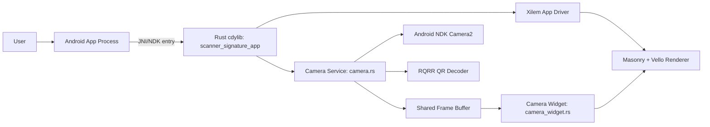
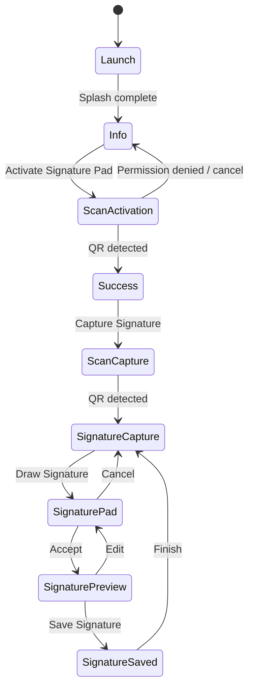
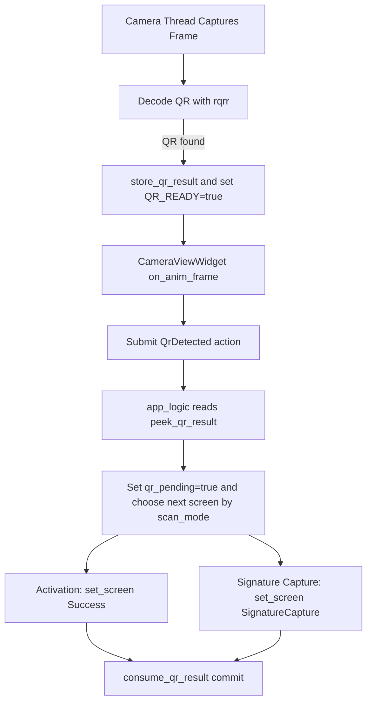
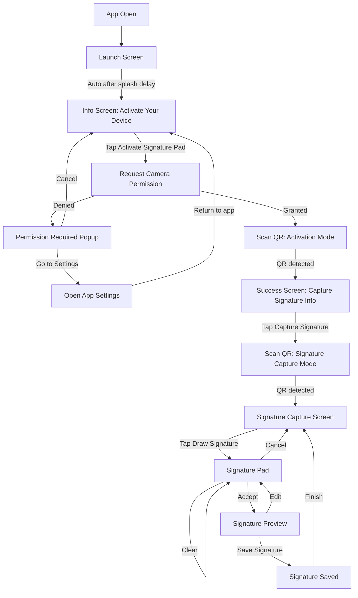

# Scanner Signature App: Project Architecture

This document explains the architecture of the scanner signature application and provides diagrams for the main runtime and screen flow.

## Project Overview

### Purpose

This project is an Android signature workflow application built with Rust for safety, performance, and modern UI behavior.

### Core Features

- Camera permission handling with Android-aware request and retry flow.
- QR-based signature workflow entry using the device camera.
- Signature draw, preview, save, and finish screens.
- Custom permission popup and responsive UI behavior.
- Crash-aware runtime recovery for Android event-loop and graphics failures.

### Architecture Summary

1. Rust Core
- Owns app state, navigation, and screen logic.
- Renders the full UI using Rust-native view/widget code.
- Uses Rust type safety and ownership to reduce runtime errors.

2. Android Integration
- Uses JNI and android-activity to interact with Android runtime features.
- Handles permission checks, app settings redirection, orientation control, and lifecycle callbacks.

3. UI Framework
- Uses Xilem for declarative UI composition.
- Uses Masonry for layout/widget infrastructure and styling primitives.
- Uses responsive layout patterns to support varying Android screen sizes.

4. Camera and Scan Layer
- Uses Android Camera2 through NDK bindings for preview and scanning.
- Decodes QR payloads and forwards results into app state transitions.
- Uses atomic flags and synchronization primitives to avoid permission/scan races.

### Key Technical Behaviors

1. Camera Permission Flow
- Detects current permission state and requests when needed.
- Shows a custom permission-required popup with Settings redirection when denied.
- Uses atomic state guards to reduce duplicate prompts and race conditions.

2. Signature Workflow
- Activation path enters QR scan and transitions to capture instructions after successful scan.
- Capture path scans QR and then moves through draw, preview, save, and finish screens.
- Signature drawing is handled in-app via signature pad views.

3. Error Handling and Recovery
- Handles event-loop and graphics-related failures with restart-safe state handling.
- Resets runtime camera/scan state as needed to restore stability.

4. Responsive UI
- Popups, buttons, and text blocks are sized and spaced for mobile screens.
- Multi-line text handling improves readability across device sizes.

### Tools and Libraries

- Rust: Core application language.
- Xilem: Declarative UI framework.
- Masonry: Layout and widget system.
- JNI and android-activity: Android platform integration.
- Vello and wgpu: Rendering backend stack.
- Cargo: Rust build and dependency management.
- Gradle: Android host app build and packaging.

### Development Workflow

1. Code
- Rust sources implement app logic, camera flow, and screens.

2. Build
- Built with Cargo for Rust components and Gradle for Android packaging.

3. Test
- Validated on Android devices for permission UX, screen transitions, and stability.

4. Deploy
- Packaged as an Android application with the Rust library integrated.

## 1) High-Level Architecture

The project is a Rust Android application built as a `cdylib`, rendered with Xilem/Masonry/Vello, and integrated with Android Camera2 through NDK APIs.

### Main layers

1. Android host layer
- `android/` Gradle project packages and launches the app.
- Calls Rust entrypoint `android_main`.

2. App orchestration layer
- `src/lib.rs` defines `AppState`, screen routing (`Launch`, `Info`, `Scan`, `Success`, `SignatureCapture`, `SignaturePad`, `SignaturePreview`, `SignatureSaved`), and app lifecycle setup.
- Owns top-level UI logic (`app_logic`).

3. Camera and QR service layer
- `src/camera.rs` manages Camera2, permission flow, frame buffering, and QR decode pipeline.
- Maintains crash-tolerant QR state via static storage.

4. Render/widget layer
- `src/camera_widget.rs` renders live camera frames and scan overlay.
- Sends `QrDetected` action into Xilem message flow.

5. UI assets layer
- `src/image_assets.rs` provides app icons and bullet assets.

6. Framework/vendor layer
- `xilem/`, `xilem_core/`, `xilem_masonry/` are framework sources.
- `vendor/masonry_core-0.4.0/` is patched Masonry core used via `[patch.crates-io]`.

## 2) System Context Diagram


```mermaid
flowchart LR
    U[User] --> A[Android App Process]
    A -->|JNI/NDK entry| R[Rust cdylib: scanner_signature_app]
    R --> X[Xilem App Driver]
    X --> M[Masonry + Vello Renderer]
    R --> C[Camera Service: camera.rs]
    C --> NDK[Android NDK Camera2]
    C --> QR[RQRR QR Decoder]
    C --> FB[Shared Frame Buffer]
    FB --> W[Camera Widget: camera_widget.rs]
    W --> M
```

## 3) Runtime Startup Flow

```mermaid
sequenceDiagram
    participant Android as Android Runtime
    participant Rust as android_main (lib.rs)
    participant Cam as camera.rs
    participant Loop as EventLoop/Xilem

    Android->>Rust: call android_main(app)
    Rust->>Rust: init logger + tracing + TMPDIR
    Rust->>Cam: store_screen_size_from_app
    Rust->>Cam: init_android_app, init_qr_channel, init_wakeup_pipe
    loop restart loop
        Rust->>Loop: run(event_loop_builder)
        alt normal exit
            Loop-->>Rust: Ok(Ok(()))
            break
        else event loop error
            Loop-->>Rust: Ok(Err(e))
            Rust->>Rust: wait_for_android_resume or sleep
        else panic
            Loop-->>Rust: Err(_)
            Rust->>Rust: wait_for_android_resume
        end
    end
```

## 4) UI Screen State Machine


```mermaid
stateDiagram-v2
    [*] --> Launch
    Launch --> Info: Splash complete

    Info --> ScanActivation: Activate Signature Pad
    ScanActivation --> Info: Permission denied / cancel
    ScanActivation --> Success: QR detected

    Success --> ScanCapture: Capture Signature
    ScanCapture --> SignatureCapture: QR detected

    SignatureCapture --> SignaturePad: Draw Signature
    SignaturePad --> SignatureCapture: Cancel
    SignaturePad --> SignaturePreview: Accept
    SignaturePreview --> SignaturePad: Edit
    SignaturePreview --> SignatureSaved: Save Signature
    SignatureSaved --> SignatureCapture: Finish
```

## 5) QR Detection and Commit Flow


```mermaid
flowchart TD
    A[Camera Thread Captures Frame] --> B[Decode QR with rqrr]
    B -->|QR found| C[store_qr_result and set QR_READY=true]
    C --> D[CameraViewWidget on_anim_frame]
    D --> E[Submit QrDetected action]
    E --> F[app_logic reads peek_qr_result]
    F --> G[Set qr_pending=true and choose next screen by scan_mode]
    G --> H[Activation: set_screen Success]
    G --> I[Signature Capture: set_screen SignatureCapture]
    H --> J[consume_qr_result commit]
    I --> J
```

## 5.1) End-to-End App Flow Diagram


```mermaid
flowchart TD
    A[App Open] --> L[Launch Screen]
    L -->|Auto after splash delay| B[Info Screen: Activate Your Device]

    B -->|Tap Activate Signature Pad| C[Request Camera Permission]
    C -->|Granted| D[Scan QR: Activation Mode]
    C -->|Denied| E[Permission Required Popup]
    E -->|Cancel| B
    E -->|Go to Settings| G[Open App Settings]
    G -->|Return to app| B
    D -->|QR detected| H[Success Screen: Capture Signature Info]

    H -->|Tap Capture Signature| J[Scan QR: Signature Capture Mode]
    J -->|QR detected| K[Signature Capture Screen]
    K -->|Tap Draw Signature| P[Signature Pad]

    P -->|Clear| P
    P -->|Cancel| K
    P -->|Accept| Q[Signature Preview]
    Q -->|Edit| P
    Q -->|Save Signature| R[Signature Saved]
    R -->|Finish| K
```

## 6) Core Modules and Responsibilities

### `src/lib.rs`
- Defines `Screen` and `AppState`.
- Contains `app_logic` state transitions and root view selection.
- Defines all UI screens (launch, activation info, scan, success, signature capture, signature pad, preview, saved).
- Android entrypoint and event-loop restart wrapper.

### `src/camera.rs`
- Camera2 setup and capture session lifecycle.
- Permission request/poll flow.
- Shared frame buffer for rendering.
- QR storage and crash-resilient two-phase commit (`peek` then `consume`).

### `src/camera_widget.rs`
- Custom Masonry widget for camera rendering.
- Rotates/scales frames for portrait display.
- Draws scan overlay and sends `QrDetected` action.

### `src/image_assets.rs`
- Provides image resources used across activation and signature-capture screens.

## 7) Directory Architecture Summary

```text
scanner_signature_app/
  android/                  Android Gradle host app
  src/
    lib.rs                  App state, screens, entrypoints
    camera.rs               Camera2 + permissions + QR state
    camera_widget.rs        Camera rendering widget + action dispatch
    image_assets.rs         UI image providers
    xyz.rs                  Alternate/legacy app variant
  vendor/masonry_core-0.4.0/  Patched masonry core
  xilem/ xilem_core/ xilem_masonry/  Framework source trees
  Cargo.toml               Rust dependencies + patch config
```

## 8) Notes for Future Evolution

1. If architecture grows, split `lib.rs` into `state`, `screens`, and `entry` modules.
2. Introduce an explicit domain layer for QR payload validation/parsing.
3. Add integration tests for screen transitions: `Info -> Scan -> Success -> Info`.
4. Add a fault-recovery policy section for GPU/device-loss handling.
